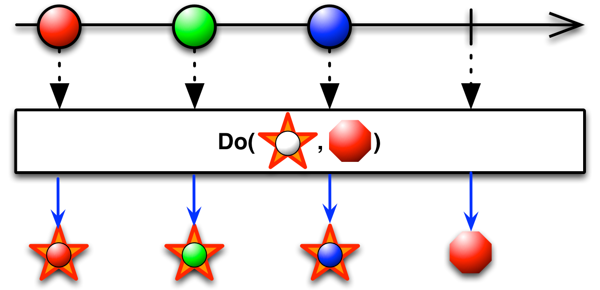

Có một vài cách để tạo **Observable**

#### 3.1.1. just

Tạo một *Observable* với một *single element*.


`just` chuyển đổi một *item* vào trong một **Observable** mà sẽ phát ra chính *item* đó.

**Examples**

```swift
import RxSwift

Observable.just("🔴")
    .subscribe { event in
        print(event)
    }.dispose()
```

```swift
// Kết quả
next(🔴)
completed
```

```swift
import RxSwift
import RxCocoa
import UIKit

weak var label: UILabel!

func setupLabel() {
	let observable = Observable.just("This is text")
    .subscribe(onNext: { text in
        label.text = text
    })
}
```

#### 3.1.2. from

Tạo một *Observable* từ một *Sequence* như Array, Dictionary hay Set.


Một hàm khởi tạo *Observable* quan trọng, khi làm việc với *Observable* có thể dễ dàng biểu diễn dự liệu của ứng dụng sang **Observable**.

**Examples**

```swift
import RxSwift
Observable.from(["🐶", "🐱", "🐭", "🐹"])
    .subscribe(onNext: { print($0) })
    .dispose()
```

```swift
// Kết quả
🐶
🐱
🐭
🐹
```

```swift
import RxSwift
import RxCocoa
import UIKit

// Need examples for iOS
```

#### 3.1.3. create

Tạo một custom **Observable** với input bất kỳ với **create**.


Tạo một custom **Observable** với đầu vào bất kì, và custom lúc nào gọi **observer** handle sự kiện (onNext, onError, onComplete)

**Examples**

```swift
import RxSwift

let disposeBag = DisposeBag()    
let myJust = { (element: String) -> Observable<String> in
    // return một Observable custom
    return Observable.create { observer in
        // Biến đổi input element
        let newElement = "New: \(element)"
        
        // Gọi observer handle sự kiện next
        observer.on(.next(newElement))
        // Gọi observer handle sự kiện completion
        observer.on(.completed)
        return Disposables.create()
    }
}
myJust("🔴")
.subscribe { print($0) }
.disposed(by: disposeBag)
```

```swift
// Kết quả
next(New: 🔴)
completed
```

```swift
import RxSwift
import RxCocoa
import UIKit

weak var usernameTextField: UITextField!
weak var passwordTextField: UITextField!
weak var loginButton: UIButton!

// Custom một Observable
let userObservable = { (username, password) -> Observable<User> in
    return Observable.create { observer in 
               let user = User(username: username, password: password)
               observer.onNext(user)
               return Disposables.create()
           }
}

func setupObservable() {
  // Observables
  let username = usernameTextField.rx.text.orEmpty
  let password = passwordTextField.rx.text.orEmpty
  let loginTap = loginButton.rx.tap.asObservable()
  
  // Đọc thêm phần combineLatest
  let combineLastestData = Observable.combineLatest(username, password) { ($0, $1) }
  
  let loginObservable: Observable<User> = loginTap
                                          .withLatestFrom(combineLastestData)
                                          .flatMapLatest { (username, password) in
                                              return userObservable(username, password) 
                                          }

  loginObservable.bind { [weak self] user in
      // Call API With User
  }.dispose()
}

final class User {
    let username: String = ""
    var password: String?

    init(username: String, password: String? = nil) {
        self.username = username
        self.password = password
    }
}
```

#### 3.1.4. range

Tạo một *Observable* mà phát ra một dãy các số nguyên tuần tự


**Examples**

```swift
import RxSwift

Observable.range(start: 1, count: 10)
          .subscribe { print($0) }
          .dispose()
```

```swift
// Kết quả
next(1)
next(2)
next(3)
next(4)
next(5)
next(6)
next(7)
next(8)
next(9)
next(10)
completed
```

```swift
import RxSwift
import RxCocoa
import UIKit

// Examples for iOS
```

#### 3.1.5. repeatElement

Tạo một *Observable* mà phát ra một element nhiều lần


Sau khi khởi tạo *Observable* với **repeatElement**, Observable sẽ phát liên tục với element input

**Examples**

```swift
import RxSwift

Observable.repeatElement("🔴")
          .take(3) // Sử dụng operator này để nhận 3 lần phát từ Observable, nếu không sử dụng, thì Observable sẽ phát liên tục
          .subscribe(onNext: { print($0) })
          .dispose()
```

```swift
// Kết quả
🔴
🔴
🔴
```

```swift
// Need for iOS
```

#### 3.1.6. doOn

Tạo một *Observable* kèm operator **doOn** có thể chèn thêm logic vào trước các event methods của **Observer** đã định nghĩa.



**Examples**:

```swift
import RxSwift

Observable.from([1, 2, 3, 5, 7]).do(onNext: { (number) in
            print("doOn      -----> \(number)")
        }).subscribe(onNext: { (number) in
            print("subscribe -----> \(number)")
        }).dispose()
```

```swift
// Kết quả
doOn      -----> 1
subscribe -----> 1
doOn      -----> 2
subscribe -----> 2
doOn      -----> 3
subscribe -----> 3
doOn      -----> 5
subscribe -----> 5
doOn      -----> 7
subscribe -----> 7
```


#### 3.1.7. empty, never, of, generate, deferred, error

Ngoài ra có các operator khác để tạo **Observable**

See `Creating Observables`: [Creating Observables](http://reactivex.io/documentation/operators.html#creating)